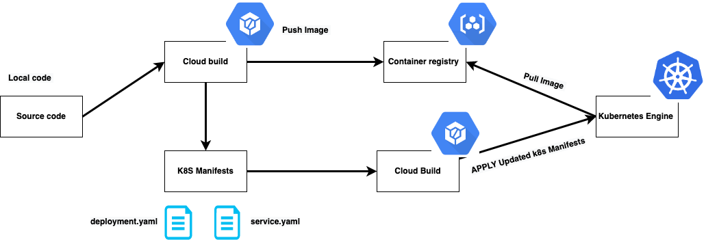

# GCP-pipeline 
This project aims at helping beginners to get familiar with some of the services offered by GCP .   

  


Important commands that you will need  : 

###   1 . Create kubernetes cluster on GCP : 

```sh
gcloud container clusters create project-kube --zone "us-west1-b" --machine-type "n1-standard-1" --num-nodes "1"
```

This will create a single noded cluster where our application is going to be deployed 


###   2 . Start the pipeline : 

```sh
gcloud builds submit --config cloudbuild.yaml
```
 


### Conclion : 
Thank you and stay tuned for more interesting projects to help you in your journey ! keep learning and keep being motivated  


